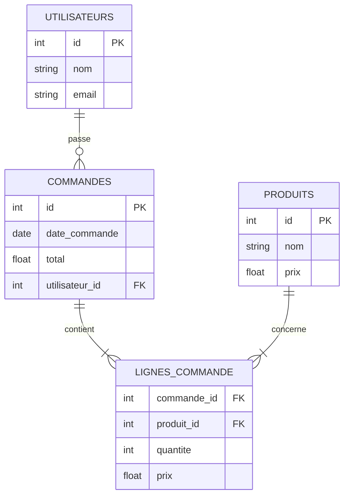

# Schéma des données

```mermaid
erDiagram
    UTILISATEURS {
        int id PK
        string nom
        string email
    }
    COMMANDES {
        int id PK
        date date_commande
        float total
        int utilisateur_id FK
    }
    PRODUITS {
        int id PK
        string nom
        float prix
    }
    LIGNES_COMMANDE {
        int commande_id FK
        int produit_id FK
        int quantite
        float prix
    }
    UTILISATEURS ||--o{ COMMANDES : passe
    COMMANDES ||--|{ LIGNES_COMMANDE : contient
    PRODUITS ||--|{ LIGNES_COMMANDE : concerne
```
